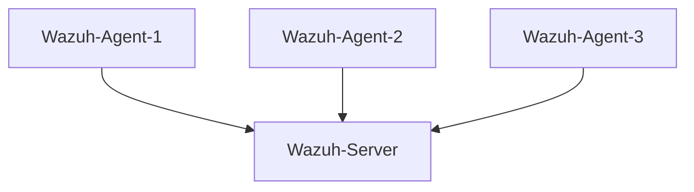
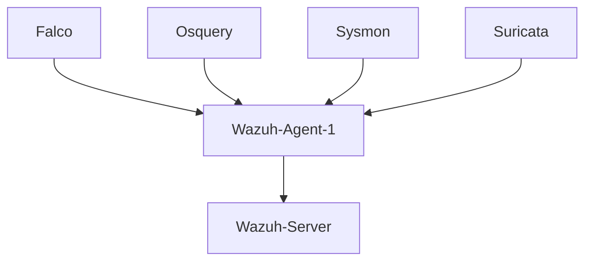
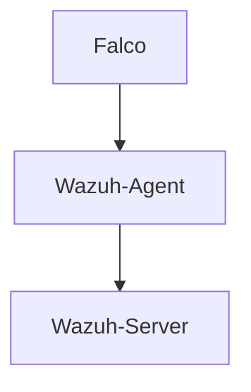
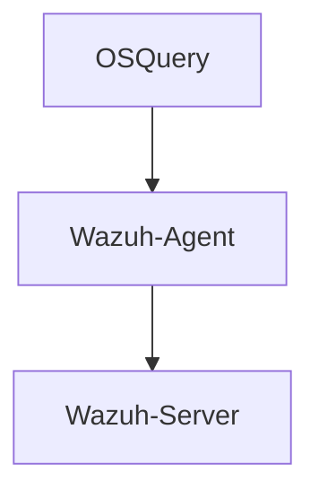
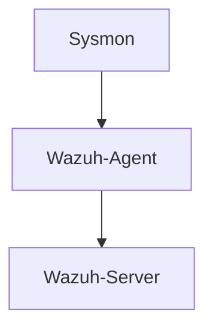
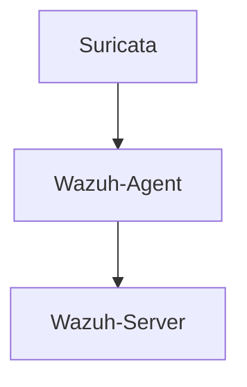
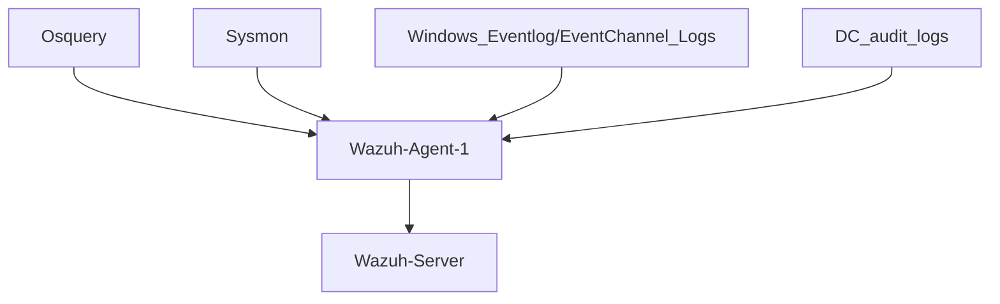

# Install Wazuh-Server on Ubuntu 20.04 
**Wazuh server: 172.16.8.121**

```
sudo apt install vim curl apt-transport-https unzip wget libcap2-bin software-properties-common lsb-release gnupg2
curl -sO https://packages.wazuh.com/4.3/wazuh-install.sh
./wazuh-install.sh -a
```


# Install Wazuh-Agents on rest of the VMs to be monitored
**Windows**
```powershell
	certutil -urlcache -f https://packages.wazuh.com/4.x/windows/wazuh-agent-4.3.10-1.msi wazuh-agent-4.3.10-1.msi
	.\wazuh-agent-4.3.10-1.msi /q WAZUH_MANAGER="172.16.8.121"
	NET START WazuhSvc
```

**Linux**
```bash
	curl -s https://packages.wazuh.com/key/GPG-KEY-WAZUH | gpg --no-default-keyring --keyring gnupg-ring:/usr/share/keyrings/wazuh.gpg --import && chmod 644 /usr/share/keyrings/wazuh.gpg
	echo "deb [signed-by=/usr/share/keyrings/wazuh.gpg] https://packages.wazuh.com/4.x/apt/ stable main" | tee -a /etc/apt/sources.list.d/wazuh.list
	apt-get update -y
	WAZUH_MANAGER="172.16.8.121" apt-get install wazuh-agent -y
	systemctl daemon-reload
	systemctl enable wazuh-agent
	systemctl start wazuh-agent
```

**Wazuh Agents default config location**

> Linux: /var/ossec/etc/ossec.conf

> Windows: C:\Program Files (x86)\ossec-agent\ossec.conf


Now all Agents will send logs back to Wazuh-Server (WAZUH01: 172.16.8.121) and we can see them from wazuh-dashboard.



But wazuh agents will only send default logs collected. To integrate other logs such as docker containers, Sysmon, DC Audit Logs, etc we can install different log collector tools like sysmon, falco, osquery to collect more logs and add use wazuh agents to send them to wazuh server.


## Let's install & configure these log collectors in ubuntu

- [1] Falco
- [2] Osquery
- [3] Sysmon
- [4] Suricata
- [5] Enable POST logging in apache2



#### [1] Install Falco

Falco is an excellent threat detection engine and log collector to monitor multiple docker containers and we can use Falco to collect container logs & send them to wazuh-server via our already configured wazuh-agent.



Let's Add Falco in NIX01 to Monitor docker containers activity

Falco  can monitor every docker container security activity and stores them in log


```bash	
apt update -y && apt install curl -y
curl -L -O https://download.falco.org/packages/bin/x86_64/falco-0.34.1-x86_64.tar.gz
tar -xvf falco-0.34.1-x86_64.tar.gz
cp -R falco-0.34.1-x86_64/* /
apt update -y
apt install -y dkms make linux-headers-$(uname -r)
# If you use the falco-driver-loader to build the BPF probe locally you need also clang toolchain
apt install -y clang llvm
falco-driver-loader module
falco-driver-loader bpf

#Edit /etc/falco/falco.yaml to enable file_output to /var/log/events.log
sed -e '/file_output/,+3 s/^/#/' -i /etc/falco/falco.yaml
cat <<EOF >> /etc/falco/falco.yaml 
file_output:
  enabled: true
  keep_alive: true
  filename: /var/log/events.log
EOF

cat <<EOF > /etc/systemd/system/falco.service
[Unit]
Description=falco
After=network.target

[Service]
User=root
WorkingDirectory=/usr/bin
ExecStart=/usr/bin/falco
Restart=always
RuntimeMaxSec=5s

[Install]
WantedBy=multi-user.target
EOF

systemctl daemon-reload
systemctl enable falco
systemctl start falco
```

Falco Logs will be stored at `/var/log/events.log`

Now we can use wazuh-agent to send this falco logs to wazuh server.

Edit wazuh-agent's config file `/var/ossec/etc/ossec.conf` and add following to enable the wazuh agent to be able to send logs to wazuh server

```
  <localfile>
    <log_format>syslog</log_format>
    <location>/var/log/events.log</location>
  </localfile>
```


#### [2] Install OSQuery in ubuntu 20.04



``` bash
echo "deb [arch=amd64] https://pkg.osquery.io/deb deb main" | sudo tee /etc/apt/sources.list.d/osquery.list
sudo apt-key adv --keyserver keyserver.ubuntu.com --recv-keys 1484120AC4E9F8A1A577AEEE97A80C63C9D8B80B
sudo apt-get update -y
sudo apt-get install osquery -y

cat <<EOF > /etc/osquery/osquery.conf
{
    "options": {
        "config_plugin": "filesystem",
        "logger_plugin": "filesystem",
        "utc": "true",
        "logger_path": "/var/log/osquery",
        "disable_logging": "false",
        "log_result_events": "true",
        "schedule_splay_percent": "10",
        "pidfile": "/var/osquery/osquery.pidfile",
        "events_expiry": "3600",
        "database_path": "/var/osquery/osquery.db",
        "verbose": "false",
        "worker_threads": "2",
        "enable_monitor": "true",
        "disable_events": "false",
        "disable_audit": "false",
        "audit_allow_config": "true",
        "host_identifier": "hostname",
        "enable_syslog": "true",
        "audit_allow_sockets": "true",
        "schedule_default_interval": "3600" 
    },

    "schedule": {
        "system_info": {
        "query": "SELECT hostname, cpu_brand, physical_memory FROM system_info;",
        "interval": 3600
        },
        "high_load_average": {
        "query": "SELECT period, average, '70%' AS 'threshold' FROM load_average WHERE period = '15m' AND average > '0.7';",
        "interval": 900,
        "description": "Report if load charge is over 70 percent."
        },
        "low_free_memory": {
        "query": "SELECT memory_total, memory_free, CAST(memory_free AS real) / memory_total AS memory_free_perc, '10%' AS threshold FROM memory_info WHERE memory_free_perc < 0.1;",
        "interval": 1800,
        "description": "Free RAM is under 10%."
        }
    },

    "packs": {
        "osquery-monitoring": "/opt/osquery/share/osquery/packs/osquery-monitoring.conf",
        "incident-response": "/opt/osquery/share/osquery/packs/incident-response.conf",
        "it-compliance": "/opt/osquery/share/osquery/packs/it-compliance.conf",
        "vuln-management": "/opt/osquery/share/osquery/packs/vuln-management.conf",
        "hardware-monitoring": "/opt/osquery/share/osquery/packs/hardware-monitoring.conf",
        "ossec-rootkit": "/opt/osquery/share/osquery/packs/ossec-rootkit.conf"
    }
}
EOF
systemctl enable osqueryd
systemctl start osqueryd
```

This'll save logs in `/var/log/osquery`

Now we can use wazuh-agent to send this falco logs to wazuh server.

Edit wazuh-agent's config file `/var/ossec/etc/ossec.conf` and add following to enable the wazuh agent to be able to send logs to wazuh server

```
  <wodle name="osquery"/>
```


#### [3] Install sysmon in ubuntu 20.04



```bash
wget -q https://packages.microsoft.com/config/ubuntu/$(lsb_release -rs)/packages-microsoft-prod.deb -O packages-microsoft-prod.deb
sudo dpkg -i packages-microsoft-prod.deb
sudo apt-get update -y
sudo apt-get install sysmonforlinux -y
#sysmon linux config file (Collect_all = Huge size: DO_NOT_USE_IN_PRODUCTION): 
wget https://gist.githubusercontent.com/Cyb3rWard0g/bcf1514cc340197f0076bf1da8954077/raw/293db31bb81c48ff18a591574a6f2bf946282602/SysmonForLinux-CollectAll-Config.xml
sysmon -accepteula -i SysmonForLinux-CollectAll-Config.xml
```

To send "sysmon logs" to wazuh server add following into agent's ossec.conf file (/var/ossec/etc/ossec.conf)

```
  <localfile>
    <log_format>syslog</log_format>
    <location>/var/log/syslog</location>
  </localfile>
```

#### [4] Install Suricata in Ubuntu 20.04


```bash
sudo add-apt-repository ppa:oisf/suricata-stable
sudo apt-get update -y
sudo apt-get install wget curl suricata -y
cd /tmp/ && curl -LO https://rules.emergingthreats.net/open/suricata-6.0.8/emerging.rules.tar.gz
sudo tar -xvzf emerging.rules.tar.gz && sudo mv rules/*.rules /etc/suricata/rules/
sudo chmod 640 /etc/suricata/rules/*.rules

wget -O /etc/suricata/suricata.yaml https://raw.githubusercontent.com/Sentinal920/File-share/main/suricata/suricata.yaml

# Add your local ip [ifconfig/ip a]
ip=192.168.182.151/24
sed -i "s|CHANGE_MY_IP|$ip|g" /etc/suricata/suricata.yaml

# Add your adaptername [ifconfig/ip a]
adapter="ens33"
sed -i "s|CHANGE_MY_ADAPTER|$adapter|g" /etc/suricata/suricata.yaml

sudo systemctl restart suricata
```

Edit wazuh-agent's config file `/var/ossec/etc/ossec.conf` and add following to enable the wazuh agent to be able to send logs to wazuh server

```
<ossec_config>
  <localfile>
    <log_format>json</log_format>
    <location>/var/log/suricata/eve.json</location>
  </localfile>
</ossec_config>
```
> sudo systemctl restart wazuh-agent


So we finally now have the logs configured in ubuntu VM that'll send all logs to wazuh server using the wazuh agent

#### [5] Enable Apache2 POST logging in /var/log/error.log
```
sudo a2enmod dump_io
cat <<EOF>> /etc/apache2/apache2.conf
DumpIOInput On
DumpIOOutput On
LogLevel dumpio:trace7
EOF
systemctl restart apache2
```

## Let's install & configure these log collectors in windows

- [1] Osquery
- [2] Sysmon
- [3] Windows Eventlog/EventChannel Logs
- [4] DC audit logs



#### [1] Install OSQuery in windows


```powershell
[Net.ServicePointManager]::SecurityProtocol = [Net.SecurityProtocolType]::Tls12
$URL = "https://pkg.osquery.io/windows/osquery-5.7.0.msi";
$SAVE = "C:\TEMP\osquery.msi"
Invoke-WebRequest $URL -OutFile $SAVE
C:\TEMP\osquery.msi /quiet
timeout 5
wevtutil im "C:\Program Files\osquery\osquery.man" 
```

To send this logs to wazuh server edit agent file and turn disabled to no for osquery `(C:\Program Files (x86)\ossec-agent\ossec.conf)`

```
		<wodle name="osquery">
		  <disabled>no</disabled>
		  ...
```

#### [2] Install Sysmon in windows

Download Sysmon on the endpoint to monitor: `https://download.sysinternals.com/files/Sysmon.zip`

Sysmon Normal Logging
```
	Invoke-WebRequest -Uri https://raw.githubusercontent.com/olafhartong/sysmon-modular/master/sysmonconfig.xml -OutFile sysmonconfig.xml
```
Sysmon Very Verbose Logging (NOT_TO_USE_IN_PRODUCTION)
```
	Invoke-WebRequest -Uri https://raw.githubusercontent.com/olafhartong/sysmon-modular/master/sysmonconfig-excludes-only.xml -OutFile sysmonconfig-excludes-only.xml
```

Run the following command to configure logging
```
	sysmon -accepteula -i path\to\sysmonconfig.xml
		or
	sysmon -accepteula -i path\to\sysmonconfig-excludes-only.xml
```

To send "sysmon windows operational event logs" to wazuh server add this into agent's ossec.conf file (C:\Program Files (x86)\ossec-agent\ossec.conf)
```
		<localfile>
			<location>Microsoft-Windows-Sysmon/Operational</location>
			<log_format>eventchannel</log_format>
		</localfile>
```


#### [3] Enable Wazuh Eventlogs & EventChannel Logging

To Send Windows Event logs back to wazuh server add following in agent's ossec.conf file `C:\Program Files (x86)\ossec-agent\ossec.conf`
```
	<localfile>
		<location>Security</location>
		<log_format>eventlog</log_format>
	</localfile>
```

Get list of all Windowsevent logs from this location: `C:\Windows\System32\winevt\Logs`

To Send Eventchannel logs back to wazuh server add following in agent's ossec.conf file `C:\Program Files (x86)\ossec-agent\ossec.conf`
```
	<localfile>
		<location>Microsoft-Windows-Sysmon/Operational</location>
		<log_format>eventchannel</log_format>
	</localfile>
```	
	

#### [4] Enable DC audit logs

```
Install-WindowsFeature GPMC
```
```powershell
# Enable Audit policies in gpmc.msc -> Default Domain Policy)
$domain_name = [System.DirectoryServices.ActiveDirectory.Domain]::GetCurrentDomain().Name
$guid=(Get-GPO -Name 'Default Domain Policy').Id.ToString()
$domain_name = [System.DirectoryServices.ActiveDirectory.Domain]::GetCurrentDomain().Name
$path = "\\$domain_name\SYSVOL\$domain_name\Policies\{$guid}\MACHINE\Microsoft\Windows NT\SecEdit\GptTmpl.inf"
if (Test-Path -Path $path -ErrorAction Ignore) 
{add-content -path $path -value "[Event Audit]`r`nAuditLogonEvents = 3`r`nAuditAccountManage = 3`r`nAuditAccountLogon = 3"}
else{Write-Output "Unable to find Path"}
gpupdate /force
```
```powershell
# Enable Audit Process Creations (https://syedhasan010.medium.com/command-line-auditing-on-windows-why-you-need-it-c2b1fcbe5d6a)
$domain_name = [System.DirectoryServices.ActiveDirectory.Domain]::GetCurrentDomain().Name
$guid=(Get-GPO -Name 'Default Domain Policy').Id.ToString()
$domain_name = [System.DirectoryServices.ActiveDirectory.Domain]::GetCurrentDomain().Name
$path = "\\$domain_name\SYSVOL\$domain_name\Policies\{$guid}\MACHINE\Microsoft\Windows NT\Audit\audit.csv"
New-Item -ItemType Directory -Force -Path "\\$domain_name\SYSVOL\$domain_name\Policies\{$guid}\MACHINE\Microsoft\Windows NT\Audit"
add-content -path $path -value "Machine Name,Policy Target,Subcategory,Subcategory GUID,Inclusion Setting,Exclusion Setting,Setting Value`r`n,System,Audit Process Creation,{0cce922b-69ae-11d9-bed3-505054503030},Success and Failure,,3"

$domain_name = [System.DirectoryServices.ActiveDirectory.Domain]::GetCurrentDomain().Name
$guid=(Get-GPO -Name 'Default Domain Policy').Id.ToString()
$domain_name = [System.DirectoryServices.ActiveDirectory.Domain]::GetCurrentDomain().Name
$path = "\\$domain_name\SYSVOL\$domain_name\Policies\{$guid}\MACHINE\comment.cmtx"
add-content -path $path -value "<?xml version='1.0' encoding='utf-8'?>`r`n
<policyComments xmlns:xsd=`"http://www.w3.org/2001/XMLSchema`" xmlns:xsi=`"http://www.w3.org/2001/XMLSchema-instance`" revision=`"1.0`" schemaVersion=`"1.0`" xmlns=`"http://www.microsoft.com/GroupPolicy/CommentDefinitions`">`r`n
  <policyNamespaces>`r`n
    <using prefix=`"ns0`" namespace=`"Microsoft.Policies.Auditing`"></using>`r`n
  </policyNamespaces>`r`n
  <comments>`r`n
    <admTemplate></admTemplate>`r`n
  </comments>`r`n
  <resources minRequiredRevision=`"1.0`">`r`n
    <stringTable></stringTable>`r`n
  </resources>`r`n
</policyComments>"

$guid=(Get-GPO -Name 'Default Domain Policy').Id.ToString() 
Set-GPRegistryValue -GUID $guid -Key 'HKLM\SOFTWARE\Microsoft\Windows\CurrentVersion\Policies\System\Audit' -Type DWORD -Valuename ProcessCreationIncludeCmdLine_Enabled -Value 1
gpupdate /force
```
